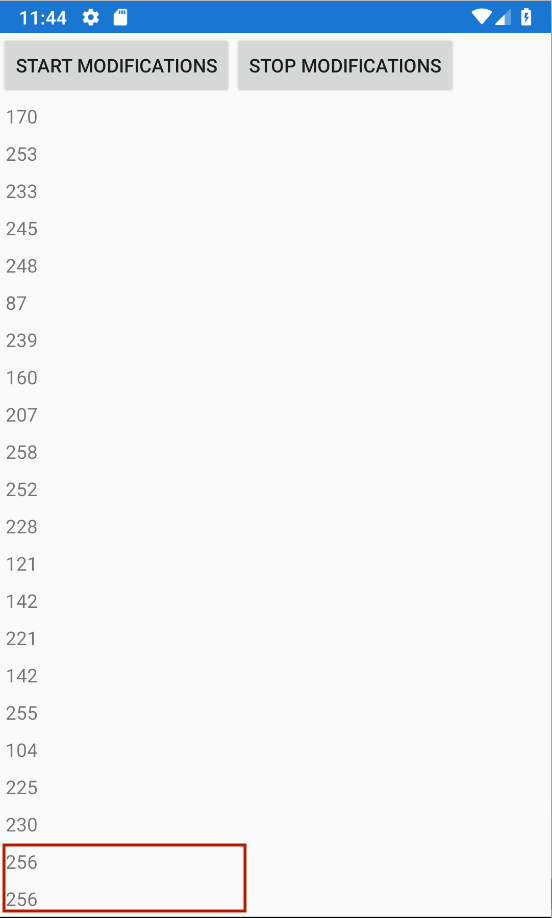

# MvxObservableCollection Crash Showcase

This demo app demonstrates a crash in the MvxObservableCollection in regards to thread unsafety on Android and iOS.

## App

This app randomly removes and adds items on a background thread into a MvxObservableCollection. A unique id is assigned to each new item.

## Reproduce the Crash

- Start the App
- Start the modification of the list entries using the button at the top
- Updates start happening on a separate thread
- Keep scrolling to the bottom of the list until the crash happens

## Bugs

### Crash

Android an iOS Crashes are reproduced here. The Crash happens due to the fact, that the MvxObservableCollection gets updated in a background thread while the view accesses the collection on the view thread to render the updated entries. Since the list is not locked, the view may access an item, that is no longer in the collection.

#### Android 
The following Crash happens on Android:

```csharp
Java.Lang.IndexOutOfBoundsException: Inconsistency detected. Invalid view holder adapter positionViewHolder{3dde0bb position=48 id=-1, oldPos=-1, pLpos:-1 scrap [attachedScrap] tmpDetached not recyclable(1) no parent} mvvmcross.droid.support.v7.recyclerview.MvxRecyclerView{f372d18 VFED..... .F....ID 0,126-1080,1731 #7f0a009d app:id/recyclerview}, adapter:mvvmcross.droid.support.v7.recyclerview.MvxRecyclerAdapter@9f978fb, layout:mvvmcross.droid.support.v7.recyclerview.MvxGuardedLinearLayoutManager@bce0556, context:md51ebd907b5225b7e06206587054b74677.MainActivity@bf554c3
  at java.lang.IndexOutOfBoundsException: Inconsistency detected. Invalid view holder adapter positionViewHolder{3dde0bb position=48 id=-1, oldPos=-1, pLpos:-1 scrap [attachedScrap] tmpDetached not recyclable(1) no parent} mvvmcross.droid.support.v7.recyclerview.MvxRecyclerView{f372d18 VFED..... .F....ID 0,126-1080,1731 #7f0a009d app:id/recyclerview}, adapter:mvvmcross.droid.support.v7.recyclerview.MvxRecyclerAdapter@9f978fb, layout:mvvmcross.droid.support.v7.recyclerview.MvxGuardedLinearLayoutManager@bce0556, context:md51ebd907b5225b7e06206587054b74677.MainActivity@bf554c3
  at at android.support.v7.widget.RecyclerView$Recycler.validateViewHolderForOffsetPosition(RecyclerView.java:5447)
  at at android.support.v7.widget.RecyclerView$Recycler.tryGetViewHolderForPositionByDeadline(RecyclerView.java:5629)
  at at android.support.v7.widget.RecyclerView$Recycler.getViewForPosition(RecyclerView.java:5589)
  at at android.support.v7.widget.RecyclerView$Recycler.getViewForPosition(RecyclerView.java:5585)
  at at android.support.v7.widget.LinearLayoutManager$LayoutState.next(LinearLayoutManager.java:2231)
  at at android.support.v7.widget.LinearLayoutManager.layoutChunk(LinearLayoutManager.java:1558)
  at at android.support.v7.widget.LinearLayoutManager.fill(LinearLayoutManager.java:1518)
  at at android.support.v7.widget.LinearLayoutManager.scrollBy(LinearLayoutManager.java:1332)
  at at android.support.v7.widget.LinearLayoutManager.scrollVerticallyBy(LinearLayoutManager.java:1076)
  at at android.support.v7.widget.RecyclerView$ViewFlinger.run(RecyclerView.java:4864)
  at at android.view.Choreographer$CallbackRecord.run(Choreographer.java:949)
  at at android.view.Choreographer.doCallbacks(Choreographer.java:761)
  at at android.view.Choreographer.doFrame(Choreographer.java:693)
  at at android.view.Choreographer$FrameDisplayEventReceiver.run(Choreographer.java:935)
  at at android.os.Handler.handleCallback(Handler.java:873)
  at at android.os.Handler.dispatchMessage(Handler.java:99)
  at at android.os.Looper.loop(Looper.java:193)
  at at android.app.ActivityThread.main(ActivityThread.java:6669)
  at at java.lang.reflect.Method.invoke(Native Method)
  at at com.android.internal.os.RuntimeInit$MethodAndArgsCaller.run(RuntimeInit.java:493)
  at at com.android.internal.os.ZygoteInit.main(ZygoteInit.java:858)

```

This is due to the fact, that the MvxObservableCollection gets updated while the view accesses the collection to render the updated entries. Since the list is not locked, the view may want to access an item, that is no longer in the collection.

#### iOS

And on iOS:
```csharp
2018-10-29 16:08:35.889227+0100 MvxObservableCollectionCrash.iOS[16104:418755] 
Unhandled Exception:
System.ArgumentOutOfRangeException: Index was out of range. Must be non-negative and less than the size of the collection.
Parameter name: index
  at System.Collections.Generic.List`1[T].get_Item (System.Int32 index) [0x00009] in /Library/Frameworks/Xamarin.iOS.framework/Versions/12.0.0.15/src/Xamarin.iOS/mcs/class/referencesource/mscorlib/system/collections/generic/list.cs:181 
  at System.Collections.ObjectModel.Collection`1[T].System.Collections.IList.get_Item (System.Int32 index) [0x00000] in /Library/Frameworks/Xamarin.iOS.framework/Versions/12.0.0.15/src/Xamarin.iOS/mcs/class/referencesource/mscorlib/system/collections/objectmodel/collection.cs:234 
  at MvvmCross.Binding.Extensions.MvxEnumerableExtensions.ElementAt (System.Collections.IEnumerable items, System.Int32 position) [0x0000f] in C:\projects\mvvmcross\MvvmCross\Binding\Extensions\MvxEnumerableExtensions.cs:78 
  at MvvmCross.Platforms.Ios.Binding.Views.MvxTableViewSource.GetItemAt (Foundation.NSIndexPath indexPath) [0x00000] in C:\projects\mvvmcross\MvvmCross\Platforms\Ios\Binding\Views\MvxTableViewSource.cs:80 
  at MvvmCross.Platforms.Ios.Binding.Views.MvxBaseTableViewSource.GetCell (UIKit.UITableView tableView, Foundation.NSIndexPath indexPath) [0x00000] in C:\projects\mvvmcross\MvvmCross\Platforms\Ios\Binding\Views\MvxBaseTableViewSource.cs:103 
  at (wrapper managed-to-native) UIKit.UIApplication.UIApplicationMain(int,string[],intptr,intptr)
  at UIKit.UIApplication.Main (System.String[] args, System.IntPtr principal, System.IntPtr delegate) [0x00005] in /Library/Frameworks/Xamarin.iOS.framework/Versions/12.0.0.15/src/Xamarin.iOS/UIKit/UIApplication.cs:79 
  at UIKit.UIApplication.Main (System.String[] args, System.String principalClassName, System.String delegateClassName) [0x0002c] in /Library/Frameworks/Xamarin.iOS.framework/Versions/12.0.0.15/src/Xamarin.iOS/UIKit/UIApplication.cs:63 
  at MvxObservableCollectionCrash.iOS.Application.Main (System.String[] args) [0x00001] in /Users/bhochschulz/Projects/MvxObservableCollectionCrash/MvxObservableCollectionCrash.iOS/Main.cs:12
2018-10-29 16:08:35.892400+0100 MvxObservableCollectionCrash.iOS[16104:418755] Unhandled managed exception:
Index was out of range. Must be non-negative and less than the size of the collection.
Parameter name: index (System.ArgumentOutOfRangeException)
  at System.Collections.Generic.List`1[T].get_Item (System.Int32 index) [0x00009] in /Library/Frameworks/Xamarin.iOS.framework/Versions/12.0.0.15/src/Xamarin.iOS/mcs/class/referencesource/mscorlib/system/collections/generic/list.cs:181 
  at System.Collections.ObjectModel.Collection`1[T].System.Collections.IList.get_Item (System.Int32 index) [0x00000] in /Library/Frameworks/Xamarin.iOS.framework/Versions/12.0.0.15/src/Xamarin.iOS/mcs/class/referencesource/mscorlib/system/collections/objectmodel/collection.cs:234 
  at MvvmCross.Binding.Extensions.MvxEnumerableExtensions.ElementAt (System.Collections.IEnumerable items, System.Int32 position) [0x0000f] in C:\projects\mvvmcross\MvvmCross\Binding\Extensions\MvxEnumerableExtensions.cs:78 
  at MvvmCross.Platforms.Ios.Binding.Views.MvxTableViewSource.GetItemAt (Foundation.NSIndexPath indexPath) [0x00000] in C:\projects\mvvmcross\MvvmCross\Platforms\Ios\Binding\Views\MvxTableViewSource.cs:80 
  at MvvmCross.Platforms.Ios.Binding.Views.MvxBaseTableViewSource.GetCell (UIKit.UITableView tableView, Foundation.NSIndexPath indexPath) [0x00000] in C:\projects\mvvmcross\MvvmCross\Platforms\Ios\Binding\Views\MvxBaseTableViewSource.cs:103 
  at (wrapper managed-to-native) UIKit.UIApplication.UIApplicationMain(int,string[],intptr,intptr)
  at UIKit.UIApplication.Main (System.String[] args, System.IntPtr principal, System.IntPtr delegate) [0x00005] in /Library/Frameworks/Xamarin.iOS.framework/Versions/12.0.0.15/src/Xamarin.iOS/UIKit/UIApplication.cs:79 
  at UIKit.UIApplication.Main (System.String[] args, System.String principalClassName, System.String delegateClassName) [0x0002c] in /Library/Frameworks/Xamarin.iOS.framework/Versions/12.0.0.15/src/Xamarin.iOS/UIKit/UIApplication.cs:63 
  at MvxObservableCollectionCrash.iOS.Application.Main (System.String[] args) [0x00001] in /Users/bhochschulz/Projects/MvxObservableCollectionCrash/MvxObservableCollectionCrash.iOS/Main.cs:12
2018-10-29 16:08:35.892744+0100 MvxObservableCollectionCrash.iOS[16104:418755] critical: Stacktrace:
2018-10-29 16:08:35.892867+0100 MvxObservableCollectionCrash.iOS[16104:418755] critical: 
Native stacktrace:
2018-10-29 16:08:35.894220+0100 MvxObservableCollectionCrash.iOS[16104:418755] critical: 	0   MvxObservableCollectionCrash.iOS    0x0000000100c70af4 mono_handle_native_crash + 244
2018-10-29 16:08:35.894345+0100 MvxObservableCollectionCrash.iOS[16104:418755] critical: 	1   libsystem_platform.dylib            0x000000010ebd2f5a _sigtramp + 26
2018-10-29 16:08:35.894422+0100 MvxObservableCollectionCrash.iOS[16104:418755] critical: 	2   ???                                 0x0000000000000000 0x0 + 0
2018-10-29 16:08:35.894522+0100 MvxObservableCollectionCrash.iOS[16104:418755] critical: 	3   libsystem_c.dylib                   0x000000010e95ac45 abort + 127
2018-10-29 16:08:35.894607+0100 MvxObservableCollectionCrash.iOS[16104:418755] critical: 	4   MvxObservableCollectionCrash.iOS    0x0000000100e7e25f xamarin_unhandled_exception_handler + 47
2018-10-29 16:08:35.894687+0100 MvxObservableCollectionCrash.iOS[16104:418755] critical: 	5   MvxObservableCollectionCrash.iOS    0x0000000100d0e4be mono_invoke_unhandled_exception_hook + 158
2018-10-29 16:08:35.894773+0100 MvxObservableCollectionCrash.iOS[16104:418755] critical: 	6   MvxObservableCollectionCrash.iOS    0x0000000100c704a8 mono_handle_exception_internal + 5976
2018-10-29 16:08:35.894855+0100 MvxObservableCollectionCrash.iOS[16104:418755] critical: 	7   MvxObservableCollectionCrash.iOS    0x0000000100c6ed49 mono_handle_exception + 25
2018-10-29 16:08:35.894953+0100 MvxObservableCollectionCrash.iOS[16104:418755] critical: 	8   MvxObservableCollectionCrash.iOS    0x0000000100beea63 mono_amd64_throw_exception + 131
2018-10-29 16:08:35.895042+0100 MvxObservableCollectionCrash.iOS[16104:418755] critical: 	9   ???                                 0x000000012fa6d5a7 0x0 + 5094430119
```

### Incorrect display

The fact that the Collection gets updated in the background may also result in incorrectly displayed items.
